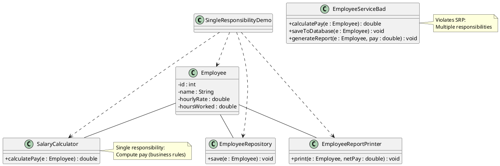
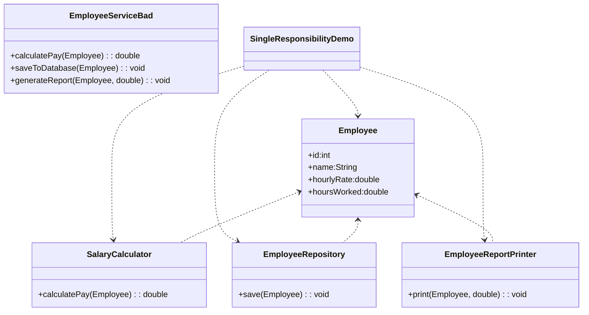
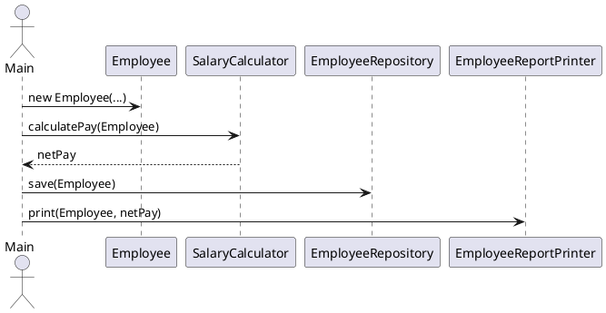

# Single Responsibility Principle (SRP) — Diagram and Explanation

File: src/LLD_Practice/SingleResponsibilityDemo.java

SRP: A class should have only one reason to change.

This demo contrasts a violating design (EmployeeServiceBad) with a compliant design that separates responsibilities across focused classes.

---

## High-level Structure (Compliant)

Each class has exactly one reason to change.

```
+-----------------------------+          +-----------------------+
|  SingleResponsibilityDemo   |          |       Employee        |
|          (main)             |--creates->  (data model only)   |
+-----------------------------+          +-----------------------+
        | uses                                  ^
            |                                   |
            v                                   |
+--------------------+     +---------------------+     +---------------------------+
|  SalaryCalculator  |     |  EmployeeRepository |     |  EmployeeReportPrinter    |
| (business logic)   |     |   (persistence)     |     | (presentation/reporting)  |
+--------------------+     +---------------------+     +---------------------------+

Flow:
1) netPay = SalaryCalculator.calculatePay(Employee)
2) EmployeeRepository.save(Employee)
3) EmployeeReportPrinter.print(Employee, netPay)
```

- Employee: stores id, name, hourRate, hoursWorked. No business/persistence/report logic.
- SalaryCalculator: computes (possibly complex) pay/tax rules. Only reason to change: pay policy.
- EmployeeRepository: saving logic (DB, file, cache). Only reason to change: storage concerns.
- EmployeeReportPrinter: formatting/printing. Only reason to change: report layout.

---

## Violating Design (Anti-Pattern)

One class handles multiple responsibilities.

```
+---------------------------+
|    EmployeeServiceBad     |
|---------------------------|
| + calculatePay(...)       |  <- business rules
| + saveToDatabase(...)     |  <- persistence
| + generateReport(...)     |  <- presentation
+---------------------------+

Multiple reasons to change:
- If tax/payout rules change  -> edit this class
- If DB or persistence changes -> edit this class
- If report layout changes     -> edit this class
Coupling unrelated concerns creates ripple effects.
```

---

## PlantUML Class Diagram (Compliant vs Violation)

You can render this with a PlantUML extension.



---

## Mermaid Class Diagram (Alternative)



---

## Sequence of Calls (Compliant)

```
SingleResponsibilityDemo
    ├── create Employee
    ├── netPay = SalaryCalculator.calculatePay(Employee)
    ├── EmployeeRepository.save(Employee)
    └── EmployeeReportPrinter.print(Employee, netPay)
```

PlantUML Sequence (optional):



---

## Why SRP Helps Here

- Isolated changes: tax logic change -> touch only SalaryCalculator.
- Swappable persistence: DB migration -> touch only EmployeeRepository.
- Independent presentation: new report layout -> touch only EmployeeReportPrinter.
- Lower coupling, clearer tests, easier maintenance.
